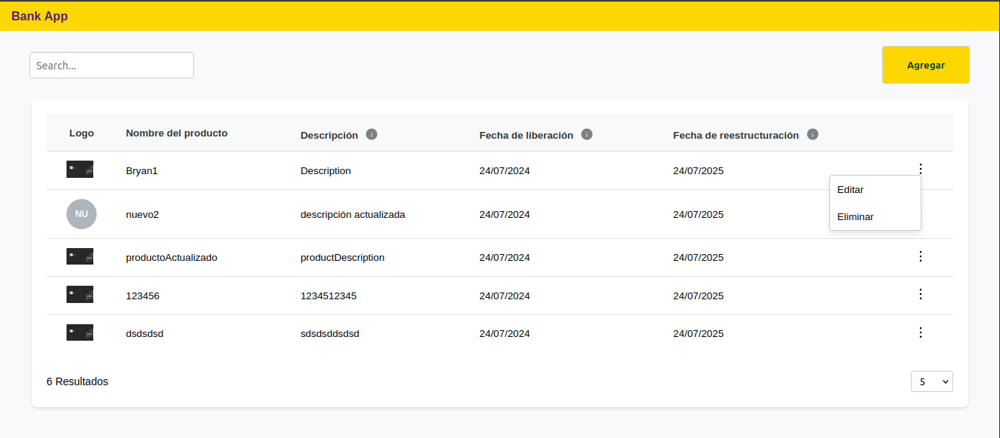

# Dev Challenge React + TypeScript

## Installation

Clone this repository

```bash
git clone https://github.com/baguilar6174/react-bank-app.git
```

Install dependencies

```bash
npm install
```

## Running the app

Run `npm run dev`

## My process

### Built with

- React
- Typescript
- Vite
- ESLint & Prettier
- React Testing Library
- React Router
- React Hook Form + Zod
- Axios
- Zustand
- SASS

## Funciones realizadas

### F1. Listado de productos financieros:

Se requiere una aplicación para visualizar los diferentes productos financieros ofertados por un
Banco cargados de una API.

### F2. búsqueda de productos financieros:

Se requiere realizar búsqueda de los productos financieros mediante un campo de texto (la busqueda se puede realizar por ID, nombre y descripción del producto).

### F3. Cantidad de registros:

Se requiere que se muestre la cantidad de resultados mostrados en el listado y un select que
permita seleccionar la cantidad de registros a mostrar debe contener los siguientes valores: 5, 10
y 20.

### F4. Agregar producto:

Se requiere la implementación un botón de “Agregar” para navegar al formulario de registro, el
formulario debe permitir la creación de un producto mediante un botón “Agregar” y debe
permitir la limpieza del formulario mediante un botón de “Reiniciar”. (Se han realizado todas las validaciones de campos y se ha implementado un botón de “Enviar” para enviar los datos al servidor).

### F5. Editar producto:

Se requiere la implementación un menú contextual (en formato dropdown) que permita
seleccionar la opción de editar por cada producto, al hacer clic se deberá navegar a la pantalla de
edición del producto y debe mantener el campo de ID deshabilitado, el formulario de editar debe
mantener las mismas validaciones de la funcionabilidad F4 y mostrar errores por cada campo.

### F6. Eliminar producto:

Se requiere la implementación una opción de eliminar dentro del menú contextual de cada
producto, al hacer clic en la opción de eliminar se deberá mostrar un modal con un botón de
“Cancelar” y un botón “Eliminar”, al hacer clic en Eliminar se debe proceder con la eliminación,
en el caso de cancelar seria solo ocultar el modal.

<table>
  <tr>
    <td align="center" valign="center"></td>
    <td align="center" valign="center"></td>
  </tr>
  <tr>
    <td align="center" valign="center"></td>
    <td align="center" valign="center"></td>
  </tr>
  <tr>
    <td align="center" valign="center"></td>
  </tr>
</table>

<table>
  <tr>
    <td align="center" valign="center"></td>
    <td align="center" valign="center"></td>
    <td align="center" valign="center"></td>
    <td align="center" valign="center"></td>
  </tr>
</table>

---

## Stay in touch

- Website - [www.bryan-aguilar.com](https://www.bryan-aguilar.com/)
- Medium - [baguilar6174](https://baguilar6174.medium.com/)
- LinkeIn - [baguilar6174](https://www.linkedin.com/in/baguilar6174)
